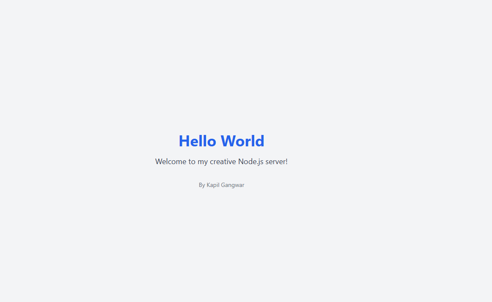

# Practice-1

## Description
This is a simple Node.js project that serves a creative "Hello World" page styled with TailwindCSS. The project demonstrates basic server functionality and creative design.

## Features
- Node.js server to serve HTML content.
- TailwindCSS for styling.
- Creative "Hello World" design.

## Installation
1. Clone the repository:
   ```bash
   git clone https://github.com/kplgngwr/CT-Assignment-01.git
   ```
2. Navigate to the project directory:
   ```bash
   cd Practice-1
   ```
3. Install dependencies:
   ```bash
   npm install
   ```

## Usage
1. Start the server:
   ```bash
   npm start
   ```
2. Open your browser and navigate to:
   ```
   http://localhost:3000
   ```

## Preview


## Author
Kapil Gangwar

## License
This project is licensed under the ISC License.
